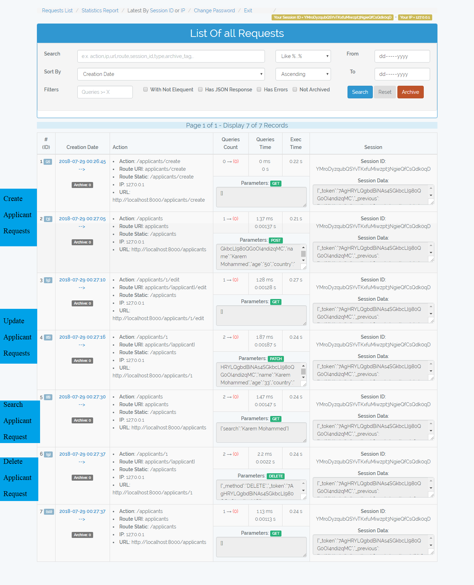
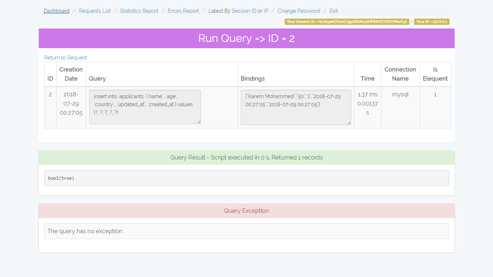
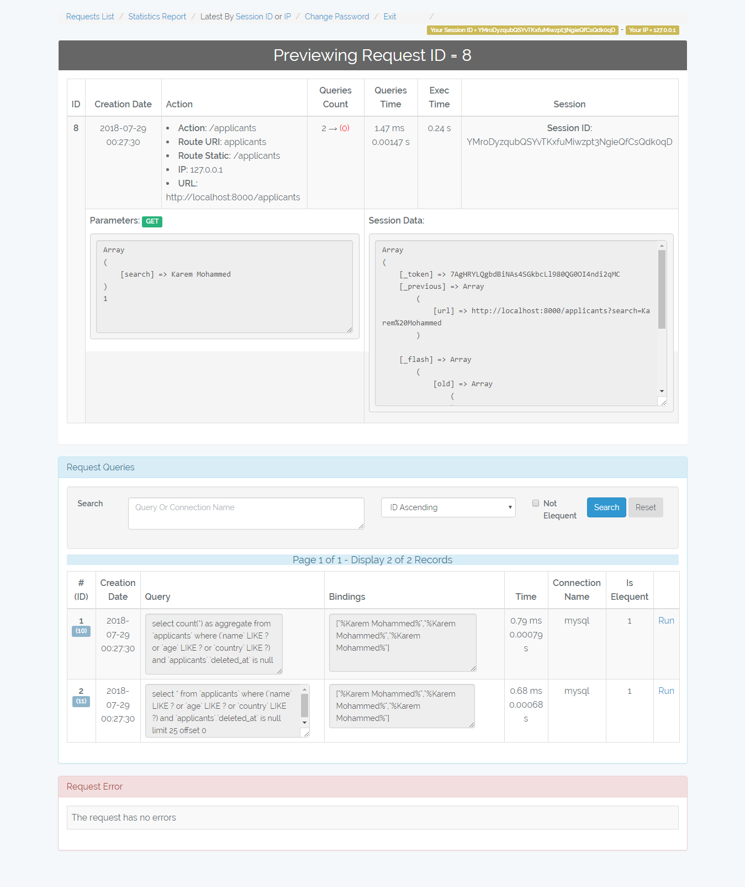
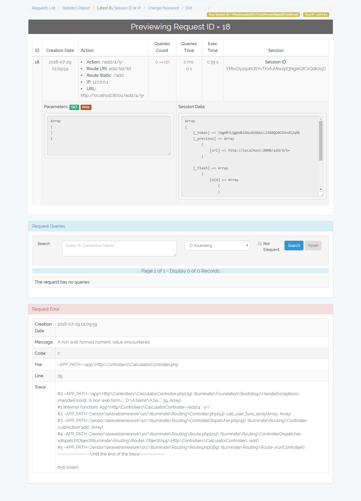
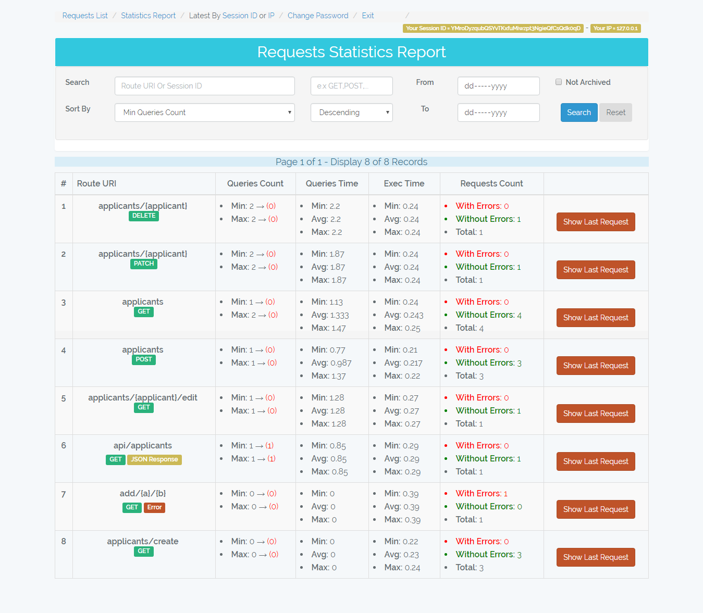
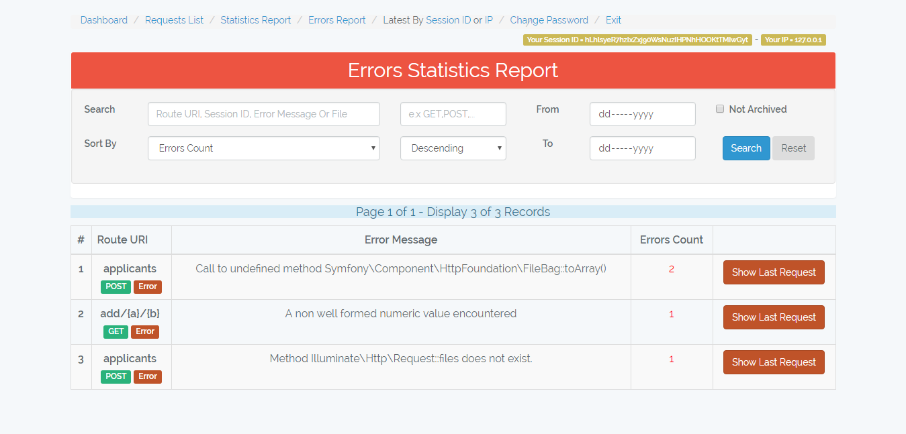

# Laravel In DB Performance Monitor
------------------------------------------
Monitor your laravel application performance by logging requests in your database then analyze it. The log includes request parameters, actions, SQL queries and errors beside that you can know the requests with raw SQL queries.

## Table of contents

<!--ts-->
   * [Requirements](#requirements)
   * [Installation](#installation)
   * [Documentation](#documentation)
      * [Configurations](#configurations)
      * [Routes](#routes)
      * [Demo Screen shots](#demo-screen-shots)
   * [Author](#author)
<!--te-->

## Requirements

    Laravel >=5.0

## Installation

1- Run `composer require asamir/laravel-in-db-performance-monitor`

2- Run `php artisan in-db-performance-monitor:init`

3- Add and configure the **inDbMonitorConn** connection in **config/database.php file**

    'connections' => [
        //...
		'inDbMonitorConn' => [
            'driver' => 'mysql',
            'host' => env('IN_DB_MONITOR_DB_HOST', ''),
            'port' => env('IN_DB_MONITOR_DB_PORT', '3306'),
            'database' => env('IN_DB_MONITOR_DB_DB', ''),
            'username' => env('IN_DB_MONITOR_DB_USERNAME', ''),
            'password' => env('IN_DB_MONITOR_DB_PASSWORD', ''),
            'charset' => 'utf8',
            'collation' => 'utf8_unicode_ci',
            'prefix' => 'asamir_',
            'strict' => false,
            'engine' => null,
        ],
	]

4- Add the this middleware in **app/Http/Kernel.php** file 

    protected $middleware = [
        //...
        \ASamir\InDbPerformanceMonitor\InDbPerformanceMonitorMiddleware::class
    ];

5- Add this line in **app/Exceptions/Handler.php** => **public function report(Exception $exception)**

    //...
    \ASamir\InDbPerformanceMonitor\LogErrors::inDbLogError($exception);

6- Run `php artisan migrate`

7- For **laravel < 5.5** add this provider in **config/app.php**

	'providers' => [
		\\...
		\ASamir\InDbPerformanceMonitor\InDbPerformanceMonitorProvider::class,
	]

**Now you can make requests and monitor it at /admin-monitor**

## Documentation
### Configurations

- The **inDbMonitorConn** connection is where the requests logs will be set, so it can be isolated in another database away from the application database or you can set it in the same database no problem.

- The package creates **inDbPerformanceMonitor.php** file in your config folder which has options
	- **IN\_DB\_MONITOR\_WORK** => If true the package will work and log the comming requests (default = true)

	- **IN\_DB\_MONITOR\_PANEL** => If false the admin panel will not be accessible and any link to '/admin-monitor/*' with throw 404 (default = true)

	- **IN\_DB\_MONITOR\_TOKEN** => Holds the admin-monitor passowrd token (default password = monitor)

	- **IN\_DB\_MONITOR\_NEGLICT\_START\_WITH** => Array of routes to neglict from log (e.x. /test so any request start with /test will not be  logged in the DB)
	
	- **IN\_DB\_MONITOR\_LOG\_PACKAGE\_QUERIES** => If true log queries made by the package in your laravel log (default = false)
	
- **Hint:** You will find the package env variables created in your .env file

### Routes

- **/admin-monitor** => The login page (default password = monitor).
- **/admin-monitor/dashboard** => Dashboard with requests counts.
- **/admin-monitor/requests** => List all requests and provided with search panel to filter the results.
- **/admin-monitor/request/{id}** => Display request details.
- **/admin-monitor/run-query/{id}** => Display query details and re-run it.
- **/admin-monitor/statistics-report** => Statistics report of requests performance group by request route uri and type.
- **/admin-monitor/errors-report** => Statistics report of requests errors by group by page uri, type, and error message.
- **/admin-monitor/changePassword** => Change the password of the admin monitor panel.
- **/admin-monitor/logout** => Logout from the admin monitor panel.
### Demo screen shots

**1- /admin-monitor** => The login page (default password = monitor)

------------------------------------------------

**2- /admin-dashboard** => Dashboard with requests counts grouped by type and archive tag.

------------------------------------------------

**3- /admin-monitor/requests** => list all logged requests

- **Search box:** search in (Action, Route, URL, Session ID, Type[POST,GET,...], Archive Tag) and in (Error Message, Error File) in case of checked **Has errors** check box

- **Not Elequent:** I mean free queries like `\DB::select(\DB::raw('select * from applicants where id = 10'));` this queries are vulnerable to SQL injection attacks. The number in red color represents the number of free queries in the request. 

- **Archive button:** Give tag => date('YmdHis') to requests with archive tag = 0 

- In the table you will find number of queries, queries total time, and request execution time.

- You can filter by creation date from => to

- If you hovered the Error label, it will display the error message, file, and line number.

- The scenario of the requests in the image below
	- Create applicant 
	- Edit Applicant
	- Search Applicant
	- Delete Applicant

- The scenario of the requests in the image below
	- Archive old requests so the appear with tag 20180729010530 and the others with tag 0 => So we can filter them 
	- Make request to **/add/{a}/{b}** which adds two integers. I passed to it 4 and 5+, so it throwed exception because 5+ is not integer.   
	- Make request to **/api/applicants** which returns json response. Hint: I used a free query `\DB::select(\DB::raw('select * from applicants'));` to retreive applicants, also notice that the request session id changed because it is not under the web middleware. 

------------------------------------------------

**4- /admin-monitor/request/{id}** => Shows the request details, queries, and error beside that it allows you to re-run the queries.

	Hint => You can quickly get your last request by Latest By Session ID Or IP
	
	By Session ID => Get last request made by your session id
	
	By IP => Get last request made by your ip (requests made by api or routes
	which don't use the web middleware will generate different session id at
	every request, so you can get them by your IP).

- Request of create applicant

...

- Request of search applicants

...

- Request of error add/4/5+

------------------------------------------------

**5- /admin-monitor/statistics-report** => Statistics report about the requests performance group by request route uri and type.

------------------------------------------------

**6- /admin-monitor/errors-report** => Statistics report of requests errors by group by page uri, type, and error message.

------------------------------------------------

**7- /admin-monitor/changePassword** => To change admin monitor panel password.

## Author

**Ahmed Samir**

**Contacts:** [eng.ahmed.samir.fci@gmail.com](mailto:eng.ahmed.samir.fci@gmail.com) | [Linkedin](https://www.linkedin.com/in/ahmed-samir-58250284/)

